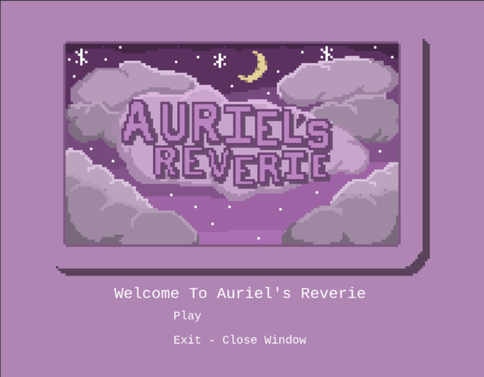
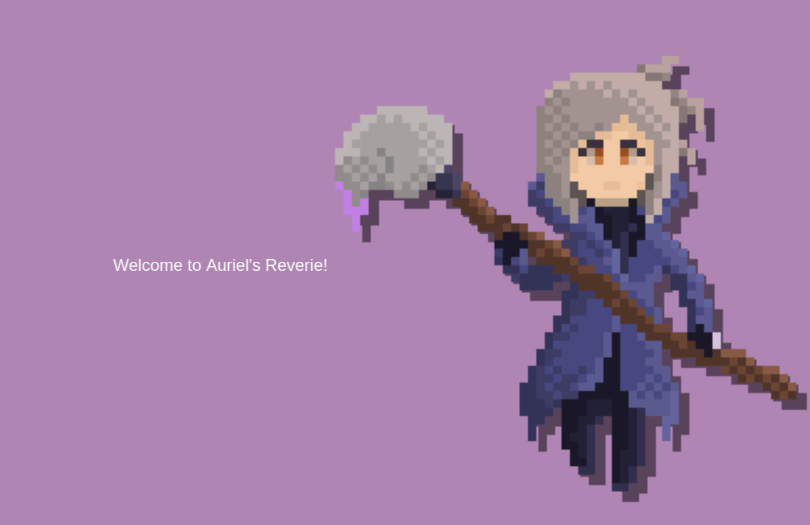
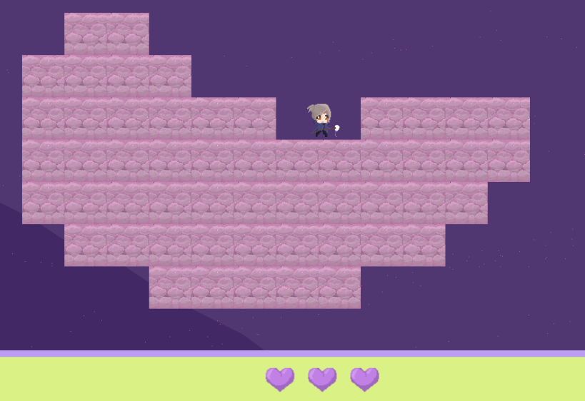
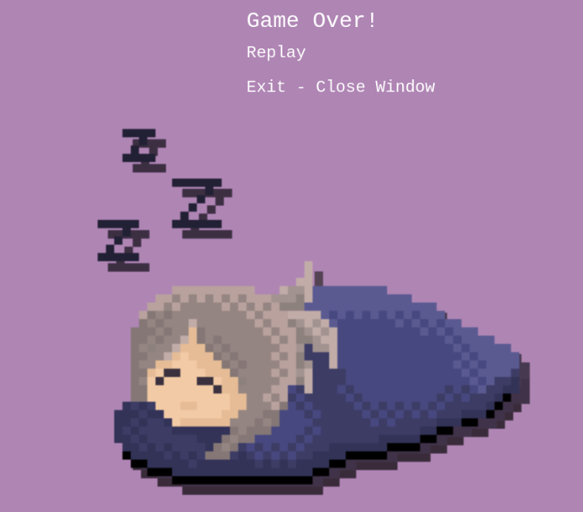
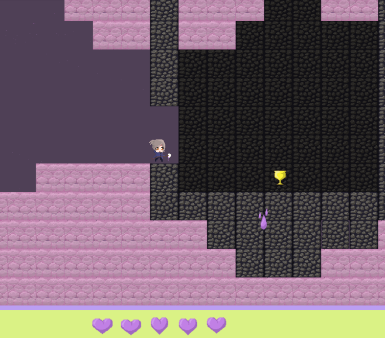
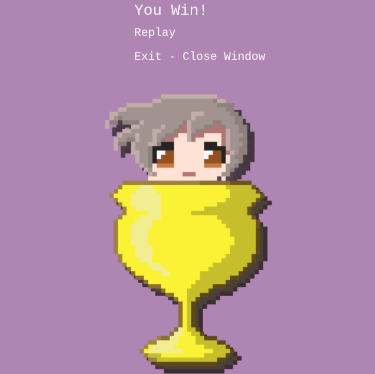
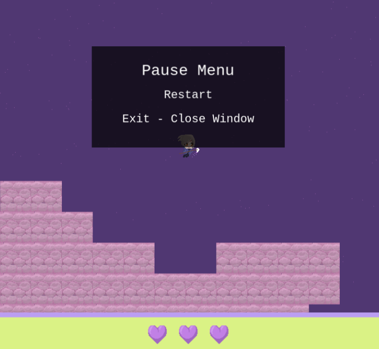
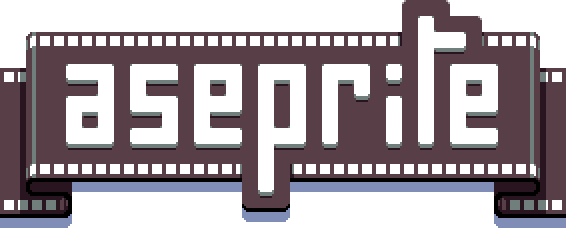
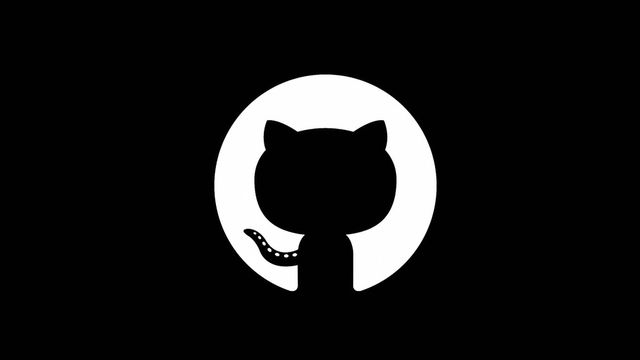
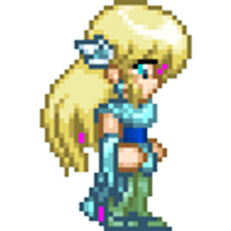

# AURIEL’S REVERIE: GAME CONCEPT 

 

## Introduction: 

The concept of “Auriel’s Reverie” is that of a 2D platformer game. The game is set in present-day North America. The game opens at the main menu, where the player is met with the choice to play the game or exit. If the player presses play, then an introductory sequence is played to give the player a light introduction into the game concept before getting into the main game scene. 

## Gameplay Mechanics: 

Platforms: The game will showcase a platform-based game map that the player will have to navigate while avoiding ink-based obstacles. 

Enhanced Mobility: Typical to most platformers, Auriel’s Reverie allows players to jump, and run much higher and faster than a realistic character could. 

Paint Brush Recovery: The ability to regain health by using collected pages to re-make more hearts for yourself. 

## Characters and Story: 

### Auriel: 

Auriel is a typical homebody, a casual laid-back individual who usually wears comfy casual clothing and doesn’t take things too seriously. That said, just because she prefers to keep safe in her home, doesn’t mean that she has no adventurous side. Auriel explores countless worlds and possibilities through her main hobby of drawing and painting. She got into art a few years prior to the start of the game after seeing so many beautiful paintings online from other artists. These pieces tugged at her soul, leaving her with a strong desire to express herself through these mediums. As such, she worked hard to develop the skills to bring whatever she could possibly imagine into the real world through her pieces. 

 

## Background: 

The game follows the artist Auriel as she daydreams about being trapped in her own sort of mind palace, which, upon closer inspection, looks more like an abandoned tower. At the top of the tower, high in the clouds, lies a nice shiny trophy just waiting to be claimed by Auriel herself. But simply walking on up there is not an option, as the way up involves several jumps across platforms all the way up. Not to mention that it’s raining ink? If Auriel isn’t careful, she could end up drowning in ink if she doesn’t fall out of the clouds first! Either way, Auriel wants that trophy, and it’s your job to help her get it! 

 

 

## Scenes: 

This game is comprised of 6 Phaser scenes including: 

### Starting Scene: 

The scene gives the player the ability to begin the game or exit. 

## Intro Scene: 

The scene gives basic context to the game before moving onto the main scene. 

## Win Scene: 

The scene that is displayed to tell the player they have won. 

## Lose Scene: 

The scene that is displayed to tell the player they have lost. 

## Main Game Scene: 

The scene contains the main game area.  

## Menu Scene: 

The scene that allows the player to pause the game, restart the game, or exit the game at any point that they wish throughout the main game scene. 

Note that GitHub Pages does NOT allow the exit option to function when requesting to close the window. 

 

## Art and Sound Design: 

The art for the game will feature 2D-pixel graphics. The main theme for the game centers around Auriel’s mind palace, which is set in a Brocken tower, high in the clouds.  As such, cloudy sky-scapes that Auriel can hop across will comprise most of the game. 

For the rest of the sound design, each jump and item collection within the game by the player should provide some audible feedback to the user. As for music, the game features a light and calm BGM track that compliments the cloud aesthetic. 

 

## User Interface (UI): 

The user interface will consist of... 

A Health Bar: This shows how much health the player has remaining. 

Main Menu: Displays options to restart, exit. 

 

## Technical Requirements: 

Technical requirements for developing this game include: 

- Knowledge of the Phaser game development workflow using JavaScript, HTML, and CSS. 

- The ability to create artwork for the game including... 

  - Background images. 

  - Player and object sprites 

  - Animated sprites 

- The ability to integrate audio design into every aspect of the game including... 

  - Interaction-related sound effects. 

  - Movement related sounds 

- The ability to design platform-based movement patterns that are engaging to the player. 

 

## Game Screenshots: 

The start screen of the game, which asks the player to either start or exit the game. 

 

The introduction scene where additional context is given. 

The beginning of the game scene where the player can now jump around freely. 

The losing scene where the player is prompted to either replay the game or exit. 

The high tower, where the trophy lies. 

 

The victory scene where the player can enjoy their trophy, replay the game, or exit. 

 

The pause menu scene, where the player can restart or exit the game. 

 

 

Resources: 

Resources used throughout the development of this game include: 

 

Phaser acts as the game engine behind Auriel’s Reverie. Phaser takes care of all the physics needed to bring this game to life. 

 

Aseprite is a pixel art software editor that allows for quick and convenient sprite and animation creation. This software was used for creating all pixel artwork for this game. 

 

Tiled is a tile map and tile set editor that allows for users to take, for example, sprites made in Aseprite, and create tile sets out of them to construct game maps for players to traverse. The map used in Auriel’s Reverie was completely constructed using Aseprite blocks that were converted into tile sets and used in the map’s construction. 

 

ChatGPT was a valuable tool for traversing Phaser’s syntax. It was especially helpful when dealing with the JSON files generated by the Tiled tile map, and for general code debugging. 

 

GitHub acts as a great version control tool to store this game project in a manner that can be easily accessible across machines. GitHub Pages also allow me to host my game for any to try. 

 

Freesound provided a convenient place to look up sound bits of anything from liquid drops to paper collection and even was the source of my winning sound bite as well. 

Paper sound effect, https://freesound.org/people/Valenspire/sounds/699357/ 

Ink sound effect, https://freesound.org/people/syrinscape/sounds/207601/ 

Jumping sound effect, https://freesound.org/people/cabled_mess/sounds/350905/ 

Winning sound effect, https://freesound.org/people/FunWithSound/sounds/456966/  

 

Lastly, OpenGameArt provided a convenient place for me to look up free audio files for BGM music. 

General BGM, https://opengameart.org/content/crystal-cave-song18 

Game lost BGM, https://opengameart.org/content/game-over-theme  

 

Concluding Statements: 

When this project was first conceived, I had no real experience with JavaScript, pixel art, animation, Phaser, or Tile maps. My original ideas for this game turned out to be lofty, as I found myself with much less time to complete what I believed I could. All in all, while this game turned out to be much less than what I originally envisioned, I learned a lot about art and animation, as well as how to make 2D games. While this project was ultimately cut short due to time constraints, I believe I now have what it takes to build something much greater in the future. 