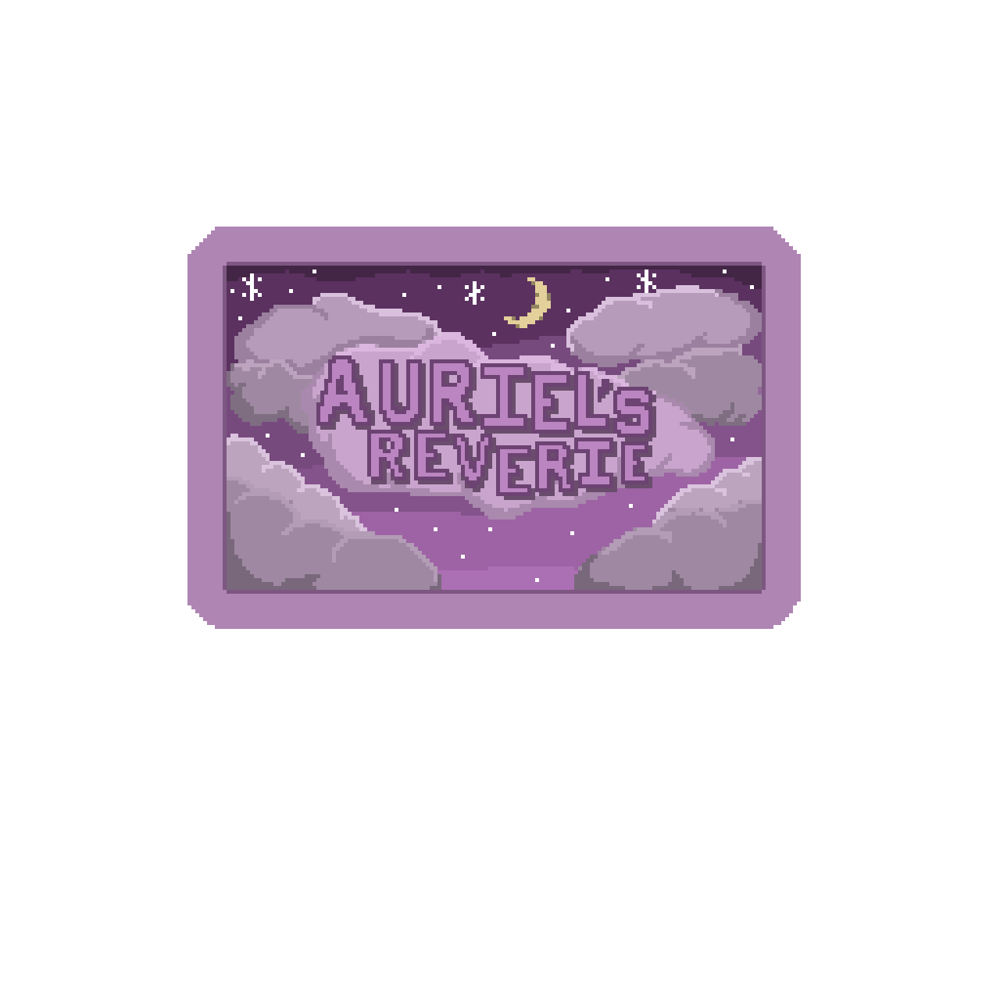

# AURIEL’S REVERIE: GAME CONCEPT

## Introduction:
The concept of “Auriel’s Reverie” is that of a 2D action-adventure platformer game. The game is set in present-day North America. The game opens at the main protagonist’s home. The protagonist is an artist named Auriel. The game itself exists in a dream world inside of Auriel’s head when she collapses at her desk from burnout and exhaustion. In a dream world, born of a distressed Artist’s mind, Auriel must face all her frustrations to find a way back out.

## Gameplay Mechanics:
- Platforms: The game will showcase a platform-based game map that the player will have to navigate to find all bosses to unlock the exit to the dream world that they find themselves in.
- Enhanced Mobility: Typical to most platformers, Auriel’s Reverie allows players to jump, dash, and slide through platforms with enhanced movement abilities.
- Paint Brush Attacks: Auriel’s character is equipped with a comically large paint brush which she uses to slash through enemies, overwriting their being with her own paint to defeat them.
- Collecting Abilities: More advanced mobility skills and attack abilities can be unlocked through playing the game and defeating boss paintings.

## Characters and Story:
Auriel is a typical homebody, a casual laid-back individual who usually wears comfy casual clothing and doesn’t take things too seriously. That said, just because she prefers to keep safe in her home, doesn’t mean that she has no adventurous side. Auriel explores countless worlds and possibilities through her main hobby of drawing and painting. She got into art a few years prior to the start of the game after seeing so many beautiful paintings online from other artists. These pieces tugged at her soul, leaving her with a strong desire to express herself through these mediums. As such, she worked hard to develop the skills to bring whatever she could possibly imagine into the real world through her pieces. 

In the present day, at the start of the game, it is shown that Auriel has been suffering through an art block for the past few weeks. This block stops her from finishing any piece due to a combination of indecision and lack of determination that shows in all their recent attempts. From these inner struggles, Auriel finds themselves in a seemingly endless loop of failures that makes her question whether she should even try to continue making art at all. 

## Main Narrative Premise:
One late evening, Auriel finds herself tired at her desk surrounded by unfinished sketches haphazardly scattered about. This scene has become a familiar sight to her at this point with some of the attempts containing aggressive marks crossed over them. Annoyed with herself and exhausted, the defeated artist dozes off at their desk.

Soon after falling asleep, Auriel finds herself in a strange place. The ground, the walls, everything is made of some distorted amalgamation of her work. Her entire surroundings are cluttered and messy sketchbook pages, some filled, some empty, some stuck out with marks of disapproval as far as her eyes can see. The only objects she can accurately pick out are some art supplies that all seem way too comically large for practical use. The only thing she can even pick up is a large paint brush whose size makes it seem more like an impractical mop than a brush.

Among the items was a large bowl of black paint. Out of curiosity Auriel dipped the brush into the paint and entertained the idea of making something with the comically large items. Soon after disturbing the supplies, however, a creature of some sort began to emerge from the bowl of paint. Auriel immediately took a few steps back having felt some clear malicious intent from the creature. A few seconds later the creature had fully exited the bowl and Auriel could get a full view of whatever it was. To her surprise, she recognized the creature. It was a living version of one of 
her failed sketches, and it was running straight for her! Having no idea what else to do and very little time to think of another way out of the situation, she closed her eyes and swung the large brush in front of her as hard as she could. 

When she opened her eyes, the creature was down, slowly dissolving in a puddle of black paint. Taking a good look around she realized that this strange world she found herself in was not just a disordered amalgamation of her past work plastered throughout the world, but a place teeming with moving and angry-looking versions of her recent failures. Just as she once slashed or struck through her failed pieces in real life, her pieces would now try and do the same to her for as long as she stays in this world. Auriel doesn’t understand how or why she got into this world, all she knows is that she wants to get the hell out of it and back into her comfy bedroom.

It is through this journey that Auriel will have to face both her previous failures and accomplished art pieces. Through her travels, she may encounter other figments of her imagination. Specters of art role models, hatters, and maybe even her past self may attempt to either push her forward or hold her back as she looks for a way out of this strange world. In this game, Auriel will travel through her art progression from its current disordered mess, to her prime, and down to her first stick figure to rediscover why she wanted to become an artist in the first place. By the end of this crazy dream, perhaps she may be able to find new inspiration to break through her art block or at the very least, be able to move forward with the courage not to give up on herself just yet!

## Levels or Scenes:
There are three main sections to the dream world that the player will have to navigate.

- **The Journey’s Origin:**
  - In this space, Auriel will revisit her old self as she was before she even learned to paint. Here, Auriel will face simple enemies representing her early art pieces while periodically having conversations with an NPC of her past self. Auriel will be able to escape this space once she defeats the boss painting at the end of the space.

- **The Prime Progression:**
  - In this space, Auriel is surrounded by some of her best works. One might feel like this type of environment would fill her with pride, however, this sight only reminds her about what she believes she’s lost. The enemies in this stage will be a bit more difficult to fight due to Auriel’s greater hostility to this point in her life. She will also encounter another version of herself here along with other NPCs representing some of her peers in this stage. This stage can be beaten by defeating its main boss.

- **The Disorder Realm**
  - In this space, Auriel will face her current despair. All her failures were still fresh in her mind ready and willing to tear her apart as she once did them. Here, Auriel will also meet some NPC, however, these visitors might not be as nice or encouraging as the others. In this final stretch, Auriel will have to take her past experiences to break through her own self-doubts to traverse this final stage to defeat the last boss and escape from this world.

## Art and Sound Design:
The art for the game will feature 2D-pixel graphics. The art direction of the four main spaces found in the game is as follows:

- **Auriel’s Room:**
  - Art: A cozy bedroom where Auriel spends most of her time.
  - Sound: A comfy track will complement this space.

- **The Journey’s Origin:**
  - Art: A relatively calm area without too much color.
  - Sound: The music here will be a bit neutral to compliment Auriel’s confusion as to where she is or what she should do.

- **The Prime Progression:**
  -  Art: A more refined feeling. Filled with completed artworks and noteworthy
sketches.
  - Sound: The music here should be more positive and energized as Auriel revisits her best works.

- **The Disorder Realm:**
  - Art: The art direction here should be more twisted. Filled with failed pieces.
  - Sound: The music should be slightly chaotic or stressful. The tracks in this area should reflect the discomfort Auriel feels as she confronts her frustration head-on

For the rest of the sound design, each hit with the brush, every jump, and landing, and every other interaction with the game by the player should provide some audible feedback to the user. As for music, each of the four spaces will have its own looped tracks with mini bosses having a separate battle track. The main bosses for each of the three dream spaces will have their own individual tracks.

## User Interface (UI):
The user interface will consist of...
- A Health Bar: This shows how much health the player has remaining.
- A Paint Bar: Special attacks consume paint and can be replenished by defeating enemies or at special locations found throughout the game.
- Skill Menu: Shows available skills with relevant descriptions.
- Main Menu: Displays options to save, exit, or change configurations of the game such as volume or key bindings.

## Technical Requirements:
Technical requirements for developing this game include:
- Knowledge of the Phaser game development workflow using Typescript, HTML, and CSS.
- The ability to create artwork for the game including...
  - Background loops
  - Enemies and other NPC-animated character sprites
  - Animated Boss Sprites
- The ability to integrate audio design into every aspect of the game including...
  - Interaction-related sound effects.
  - NPC audio sound effects
- The ability to design platform-based movement patterns that are engaging to the player.
- The ability to design interesting and engaging boss patterns for players to enjoy.

